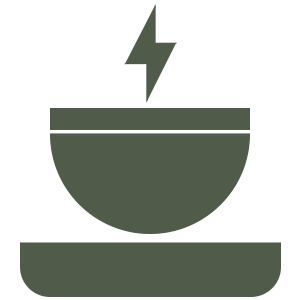

# coffeinflash (beta)

Client site chat with no database driven by **socket.io, express and node.js**.

## install and run locally

Install all required packages

```npm install```

Run locally

```npm run dev```

Connect with a random alias:

`localhost:3000/{alias}`

## proposal for this project

- Starting a chat by a **shareable url**. I really appreciate it the way [**jitsi**](https://meet.jit.si/) does it.
- Having **Nicknames**
- Meeting **random people** connect to random available people
- **Destroying** each chat after you leave the page/close the session (also means storing nothing in the backend)
- No user accounts what so ever...
